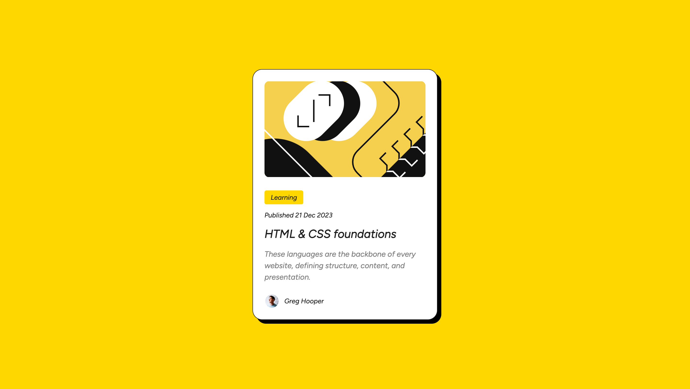

# Frontend Mentor - Blog preview card solution

This is a solution to the [Blog preview card challenge on Frontend Mentor](https://www.frontendmentor.io/challenges/blog-preview-card-ckPaj01IcS). Frontend Mentor challenges help you improve your coding skills by building realistic projects.

## Table of contents

- [Overview](#overview)
  - [The challenge](#the-challenge)
  - [Screenshot](#screenshot)
  - [Links](#links)
- [My process](#my-process)
  - [Built with](#built-with)
  - [What I learned](#what-i-learned)
  - [Continued development](#continued-development)
  - [Useful resources](#useful-resources)
- [Author](#author)

**Note: Delete this note and update the table of contents based on what sections you keep.**

## Overview

### The challenge

Users should be able to:

- See hover and focus states for all interactive elements on the page

### Screenshot



### Links

- Solution URL: [Add solution URL here](https://github.com/lij110397/blog-preview-component)
- Live Site URL: [Add live site URL here](https://lij110397.github.io/blog-preview-component/)

## My process

### Built with

- Semantic HTML5 markup
- CSS custom properties
- Flexbox

### What I learned

**1.How to make better use of figma files to build html and css files**

- We can check the layers and frames of figma design and create html labels according to the design.
- Check figma's library to include all defined colors and typography.

**2. How to place the component in the middle of its parent container**
Make the parent container a flexbox and use align-items and justify-content.
```css
display: flex;
align-items: center;
justify-content: center;
```
**3. Variable font and static font**
- Variable font includes different font styles and font weights of the font. In this case, the definition of font family decreased as we can define only one variable font and change its styles and weigths accordingly.
- Static font means we need to create font family for every variable of the font and give them different names.

### Continued development

**1.How to reduce the font size in mobile layout without using media queries?**
Confusing and just don't know the solution.

**2.**

### Useful resources

- [Resource 1](https://developer.mozilla.org/zh-CN/docs/Learn/CSS/Styling_text/Web_fonts) - This helped me for font definition.
- [Resource 2](https://validator.w3.org/) - This is a link about how to check HTML files.
- [Resource 3](https://jigsaw.w3.org/css-validator/) - This is a link about how to check CSS files.


## Author

- Website - Jiao Li